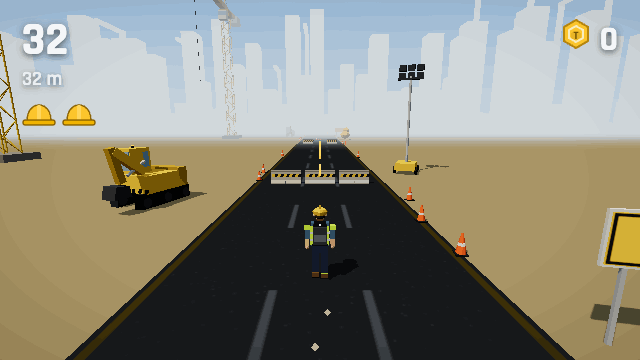
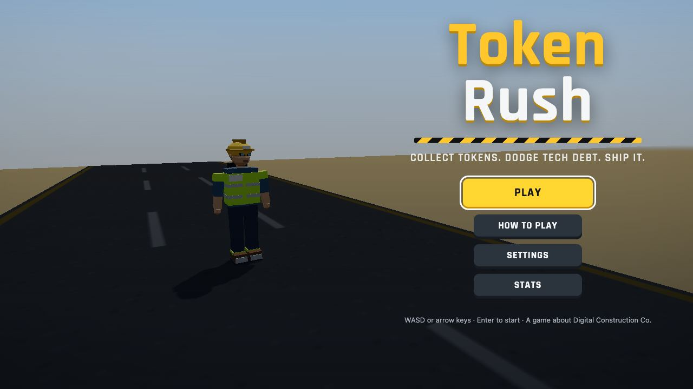
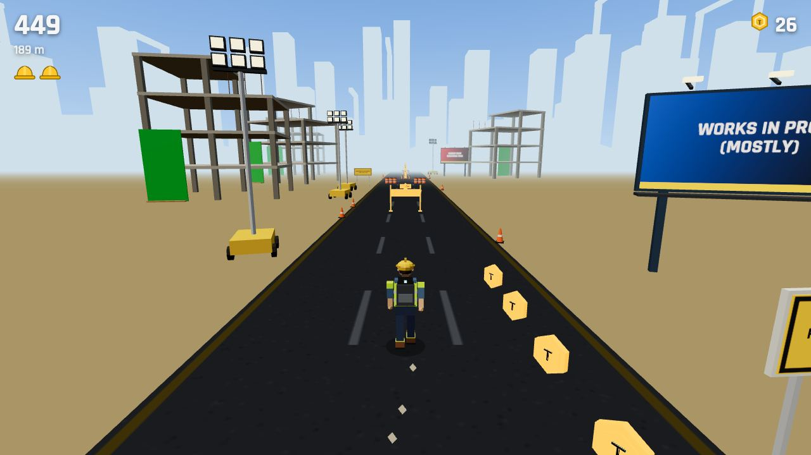
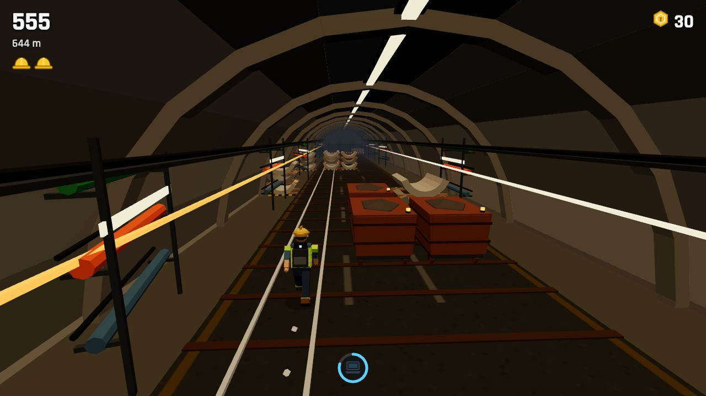
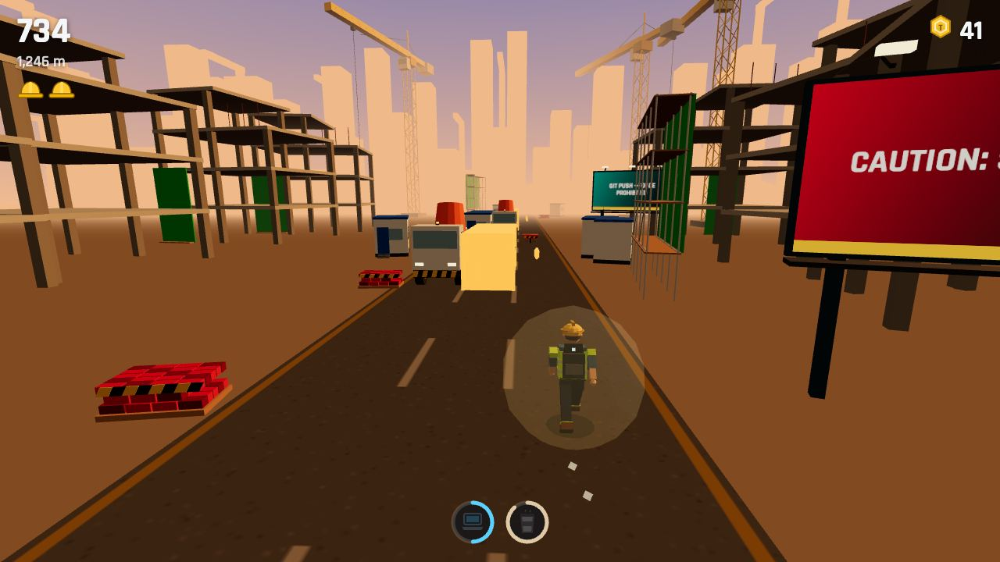
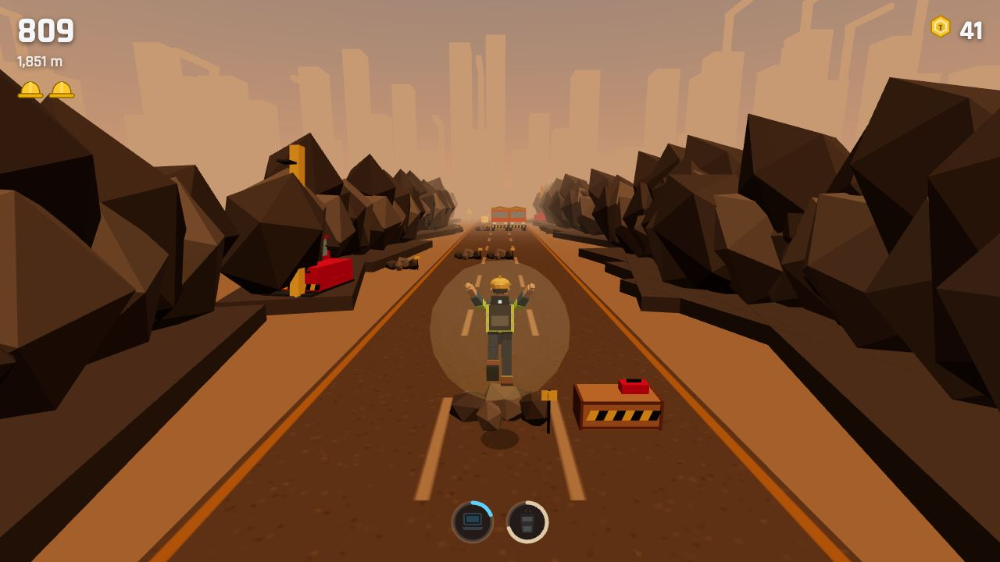
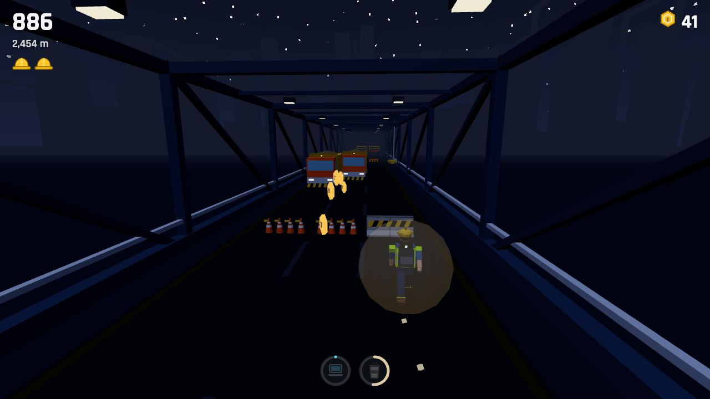

# Token Rush

A 3D endless runner for the browser, built with three.js and TypeScript. You play a developer sprinting through construction and infrastructure sites, collecting **tokens** so you can afford to prompt the AI, dodging site traffic and staying ahead of a rolling boulder of **tech debt**.



> Unaffiliated with any employer or brand. All models, sounds and music are original and made for this project (models in Blender, audio synthesised at runtime).

| | |
|---|---|
|  |  |
|  |  |
|  |  |

## Run it

Requires Node 20+ (developed on Node 24).

```sh
npm install
npm run dev          # http://localhost:5173
npm run build && npm run preview
```

Targets current Chrome and Safari on macOS (tested automatically with Playwright's Chromium and WebKit).

## Controls

| Action | Keys (default) | Arrows | Trackpad (enable in Settings) |
|---|---|---|---|
| Lane left / right | A / D | ← / → | two-finger swipe left / right |
| Jump | W or Space | ↑ | swipe up |
| Slide (in the air: fast-fall) | S | ↓ | swipe down |
| Pause | Esc or P | Esc or P | |
| Mute | M | M | |

Pointer/touch drag swipes also work. You can tune swipe sensitivity in Settings.

## What's in the game

- **Three lanes, jump, slide and fast-fall.** Input is buffered for 120 ms and you get 80 ms of coyote time.
- **Five zones, 600 m each:** Road Works, Tunnel, Building Site, Drill Site, and Bridge (night shift). Sky, fog, light and music blend between them.
- **Obstacles you can read at speed:**
  - Low (yellow/black stripes): jump over.
  - Overhead (red/white bar at head height): slide under.
  - Vehicles and containers: change lane.
  - Moving hazards (beacon, beeps and a HUD lane arrow, at least 1.2 s ahead): get out of that lane.
  - Ramps: lead onto container rooftops.
- **Lives the original way:** a stumble greys out a hard hat and brings the Tech Debt boulder into view. Stumble again before it falls back and it catches you. Hitting a vehicle head-on ends the run.
- **Power-ups:** Laptop (token magnet), Energy drink (jetpack), Coffee (shield), AI spark (×2 score), Safety boots (super jump), Mystery box.
- **Difficulty:** reaches maximum after about 2 minutes. A typical non-perfect run lasts 1.5–3 minutes.
- **Saved locally:** highscore, best distance, total tokens ("enough tokens for N prompts") and all settings.

## Development

| Script | What it does |
|---|---|
| `npm run typecheck` / `lint` / `test` / `build` | The quality gate (also run in CI) |
| `npm run test:e2e` | Playwright in Chromium: smoke, bot run, flows, performance budget, screenshots |
| `npm run test:safari` | Playwright in WebKit: smoke + bot run |
| `npm run soak` | Perfect autoplay bot, 24 seeds × 4 minutes (fairness soak) |
| `npm run balance` | Non-perfect bot, median run length (difficulty target) |
| `npm run media` | Regenerates the README screenshots and GIF |

URL flags: `?seed=123` (reproducible run), `?debug=1` (overlay plus hotkeys: G god mode, 1–6 power-ups, T slow motion, N next zone, K faster), `?bot=1` (autoplay).

### Architecture

```
src/
  sim/      pure game logic, no three.js: player physics, collision, generator, fairness
            validator, power-ups, lives, scoring, autoplay bot
  core/     fixed-timestep loop, input, trackpad gestures, state machine, seeded RNG, storage
  render/   three.js view: Blender model library + instancing, zones, sky, VFX, post, camera
  audio/    WebAudio engine, synthesised SFX, procedural music
  ui/       DOM overlays: menu, HUD, settings, help, pause, game over
  data/     tuning.ts (every gameplay number), patterns, zones, obstacles, signs
art/        Blender build scripts, palette and the .blend source
```

- The simulation runs at a fixed 60 Hz and the renderer interpolates. The world is a treadmill: the player stays at z = 0 and the track moves.
- **Fairness:** the track is built from hand-authored patterns (`src/data/patterns.ts`). A row-level reachability search (`sim/fairness.ts`) checks every pattern at every tier it can appear in. At runtime, every join between patterns is checked at several speeds across the tier, and from every lane the player could be in.
- **Autoplay bot:** `sim/bot.ts` uses the same search to play the game. It drives the soak and balance runs.

### Tuning

All gameplay numbers live in [`src/data/tuning.ts`](src/data/tuning.ts): speeds, the speed curve, jump and slide physics, lives and gap, power-up durations, spawn schedule, moving-hazard timing, camera, input thresholds and render budgets. Change a value, then run `npm test`; `npm run soak` and `npm run balance` show the effect on fairness and run length.

### 3D models (Blender)

Every object in the game is modelled in Blender by the scripts in [`art/blender/`](art/blender). Each face's UVs point at a swatch in a shared 8×8 palette (`art/palette.json`), so the whole world draws with one material and instanced meshes.

To rebuild and re-export all models into `public/models/`, run this in Blender's Python console:

```python
TOKEN_RUSH_ROOT = '/path/to/token-rush'
exec(open(TOKEN_RUSH_ROOT + '/art/blender/build.py').read())
```

Set `ONLY = ['excavator']` first to rebuild a subset. `art/token-rush-assets.blend` holds the generated sources. If a `.glb` is missing, the game falls back to labelled boxes.

### Branches and commits

`main` is always green. Each piece of work happens on a branch, with conventional commits (`feat:`, `fix:`, `chore:` ...), and lands as a pull request that is squash-merged after CI passes.

## License

[MIT](LICENSE)
